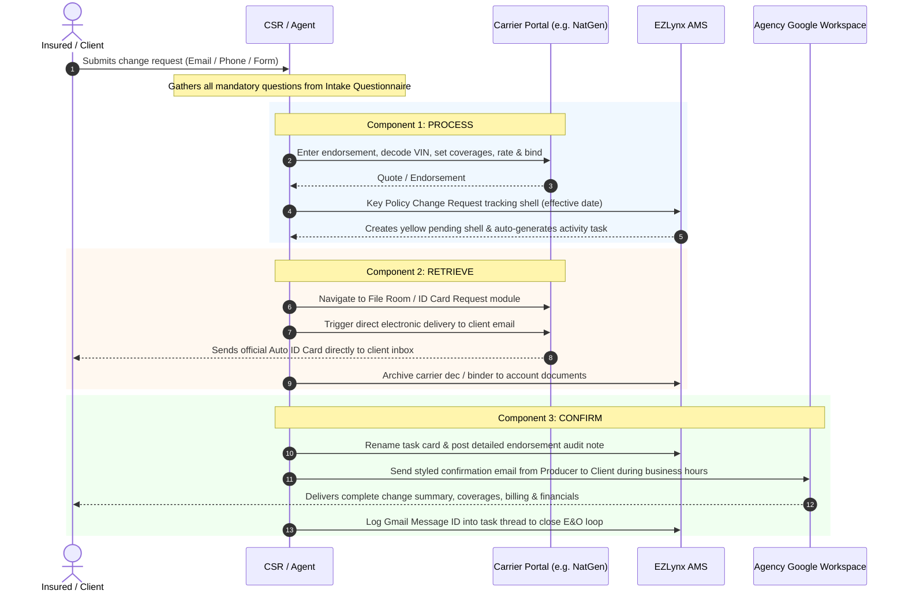

# StreetSmart Insurance: Policy Change Master Standard Operating Procedure (SOP)

**Document ID**: SOP-OPS-042  
**Effective Date**: September 8, 2026  
**Applies To**: Personal Lines CSRs, Commercial Lines Account Managers, Producers, Quality Controllers, and Autonomous Agent Systems  
**Core Standard**: 3-Component Closed Loop System (Process, Retrieve, Confirm)

---

## 1. Operating Philosophy & E&O Safeguards

In insurance agency operations, an endorsement is an active alteration of a legally binding contract. A breakdown at any step creates catastrophic Errors & Omissions (E&O) exposure, accounting discrepancies, or coverage gaps.

### The Five Inviolable Safeguards
1. **Never Mutate Historical Policies in EZLynx**: Direct editing of the active base policy corrupts policy accounting history and prevents IVANS electronic download matching. Always key a **Policy Change Request tracking shell**.
2. **Never Backdate Without Carrier Authorization**: Backdating an endorsement without carrier approval is a severe compliance violation. If the customer requests a retroactive change, verify vehicle sale date or cancellation date and obtain underwriter binding authority.
3. **Written Documentation for Reduced Coverages**: Any request to drop Comprehensive/Collision (moving to Liability-Only) or reduce liability limits must have explicit written authorization from the Named Insured on file.
4. **Mandatory Confirmation Subject Formatting**: Every client confirmation email must strictly include:
   `StreetSmart Insurance: Policy Change Confirmation & Auto ID Card - [Insured Name] - Policy #[Policy Number] ([Change Description])`
5. **Business Hours Dispatch Mandate**: All client-facing confirmation emails must be dispatched during regular agency business hours (9:00 AM – 5:30 PM ET).

---

## 2. The 3-Component Closed Loop Lifecycle

---

## 3. Step-by-Step Execution Protocol

### Step 1: Intake & Validation
- Reference [`resources/policy_change_intake_questionnaire.md`](file:///opt/renewal-automation-system/.agents/skills/streetsmart-policy-change-process/resources/policy_change_intake_questionnaire.md).
- Ensure all mandatory fields for the transaction type are captured.
- Verify the identity of the requester (must be Named Insured or authorized representative).

### Step 2: Component 1 — Process
1. **Carrier Portal Execution**:
   - Access carrier site via authenticated session.
   - Execute entity change (Vehicle addition/removal, driver addition/exclusion, garaging address update, coverage revision).
   - Verify rating worksheet: record the **Pro-Rated Change Amount** (itemizing premium and statutory fees) and the **Revised Full-Term Premium**.
   - Commit the binding transaction. Capture screenshot of bound confirmation.
2. **EZLynx Tracking Shell Keying**:
   - Navigate to applicant policy in EZLynx (`/applicantportal/Policy/Actions/ChangeRequest/[ApplicantID]/[PolicyMasterID]`).
   - Enter requested effective date.
   - Enter tracking note: `"[Change Description] - Submitted on Carrier Portal (Pending Download)"`.
   - Save and verify the yellow pending row in Policy History (`/policy/[PolicyMasterID]/history/index`).

### Step 3: Component 2 — Retrieve
1. **Carrier Document Inspection**:
   - Access the carrier's File Room / Document History.
   - Verify that the endorsement transaction generated the appropriate policy documents.
2. **Auto Insurance ID Card Delivery**:
   - For auto endorsements, navigate to the carrier's ID card request module (e.g. `Summary/IDCardRequest.aspx`).
   - Switch to the **Email** tab.
   - Enter Insured Name and Email Address.
   - Click **Send Email** to trigger direct carrier delivery.
   - Download a copy for the agency document archive under `data/documents/` and upload to EZLynx Document Management.

### Step 4: Component 3 — Confirm
1. **EZLynx Task & Discussion Update**:
   - Locate the auto-generated task in Activity: `Personal Auto Policy Change Request - CHANGE ME`.
   - Rename title: `Personal Auto Policy Change Request - [Description of Change], effective [Date], [Coverage Details].`
   - Post comprehensive audit note detailing:
     - Policy number & carrier.
     - Endorsement / Quote # and effective date.
     - Exact modified entity (VIN, Year/Make/Model, Garaging, Driver).
     - Exact coverages (Liability-only vs full coverage, deductibles).
     - Financial breakdown (Pro-rated delta, full-term revised total, billing mode).
     - ID card delivery confirmation.
     - Assignment to CSR for IVANS download reconciliation.
2. **Client Confirmation Email**:
   - Dispatched during business hours using Google Workspace Domain-Wide Delegation as the assigned Producer.
   - Subject: `StreetSmart Insurance: Policy Change Confirmation & Auto ID Card - [Insured Name] - Policy #[Number] ([Change Description])`.
   - Itemize all changes, coverages, billing plan, and ID card notice in styled HTML and plain text.
3. **Closing the Audit Loop**:
   - Reply to the EZLynx discussion card with the Google Workspace Message ID (e.g. `1a08225aa8e5d271`) to certify that notice was delivered to the client.

---

## 4. Reconciliation via IVANS Electronic Download (PCH)
When the carrier processes the policy change, it transmits an electronic download transaction (`PCH`) through the IVANS clearinghouse overnight.
1. Open the EZLynx **Policy Change Request OPEN** report.
2. Open Policy History for the account.
3. Locate the yellow tracking row.
4. Click `Actions` -> `Confirm Change`.
5. Select the matching downloaded `PCH` transaction.
6. Verify 3-way match (Request, Carrier Document, EZLynx Policy Record).
7. Confirm the change. The yellow tracking shell merges into the download transaction, and the open change badge is cleared.
8. Append the closure note: `"[Date] Quality Controller - Policy change confirmed and reconciled. Robie was here"`.
