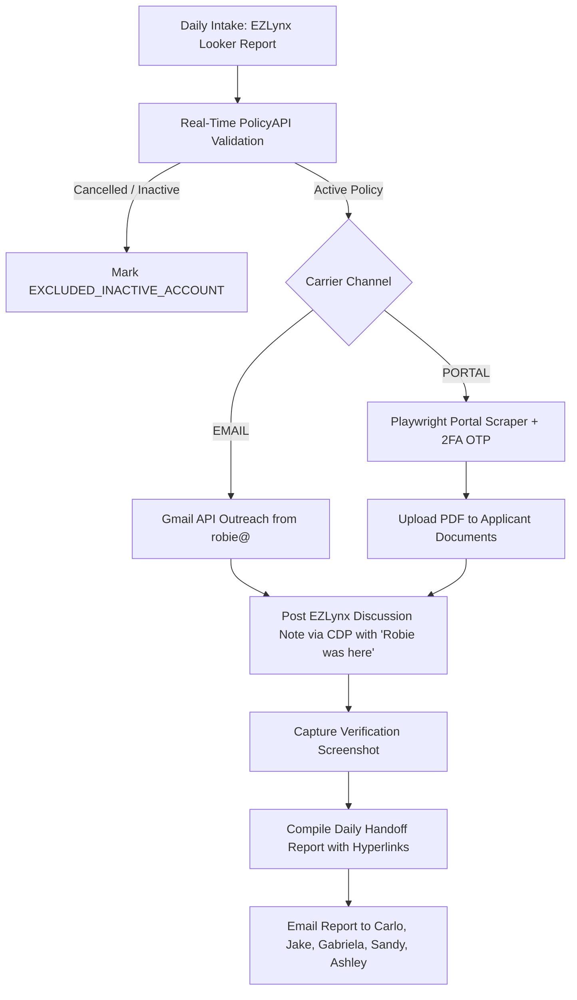

# StreetSmart Insurance - Autonomous Manual Renewal SOP & Master Handoff

**Author / Operator:** Robie (`robie@streetsmart.insurance` / `hello@streetsmart.insurance`)  
**Project:** Autonomous Manual Renewal Engine for Non-Download Policies  
**Target Agency Management System:** EZLynx  
**Last Updated:** September 05, 2026  

---

## 1. Executive Summary & Architecture

This system automates the non-download manual policy renewal workflow for StreetSmart Insurance across a 50-day expiration window. Unlike downloading carriers that sync via IVANS, manual policies require active portal retrieval or direct underwriter email outreach, followed by audit notes in EZLynx and quote preparation for account managers.

### The Autonomous Engine Lifecycle:


---

## 2. Critical Operational Rules & Lessons Learned

### Rule 1: Real-Time EZLynx Cancellation Check (Mandatory)
- **Problem**: Raw Looker intake CSVs export 1-year policy boundaries without reflecting mid-term cancellations.
- **Solution**: Before performing any outreach or portal check, query:
  `GET /PolicyAPI/v1/PolicyCard/GetPolicies?applicantId={applicantId}`
- **Criteria**:
  - `policyStatusViewModelID == 1` AND `cancellationDate == null` -> **ACTIVE** (Proceed).
  - `policyStatusViewModelID == 2` OR `cancellationDate != null` OR `transactionType == 'Cancel Confirmation'` -> **CANCELLED** (Mark `EXCLUDED_INACTIVE_ACCOUNT`, Do NOT email underwriter).
- **Verified Examples Filtered**:
  - `The Tree Guy Service LLC` (`58135101` - Johnson & Johnson) -> Cancelled 2025-08-01.
  - `Varsity Moving LLC` (`32941812` - Cover Whale) -> Cancelled 2026-02-15.
  - `Kadhampa Buddhist Manjushri Society` (`198245850`) -> Cancelled 2025-10-03.
  - `Pro Built Interiors LLC` (`21587530`) -> Cancelled 2025-06-25.

### Rule 2: Outbound Email Standards & Sender Signature
- **Sender Address**: `robie@streetsmart.insurance` (fallback: `hello@streetsmart.insurance`).
- **Signature**: Must ALWAYS be signed by **Robie**, NEVER the CSR:
  ```text
  Should you have any questions please feel free to email me back.

  Thank you,

  Robie
  StreetSmart Insurance
  ```
- **CC Recipients**: The assigned CSR (`maria@`, `sandy@`, `andrea@`, etc.) and `jake@streetsmart.insurance` must always be on CC.
- **Subject Tracking Tag**: Every subject line must include `[RENEWAL-REQ-###]`.

### Rule 3: EZLynx Discussion Note Protocol
- **Target Discussion**: Find the discussion card matching the renewal line of business (`Commercial Auto Renewal [Year]`, `Commercial Package Renewal`, `Excess Manual Renewal`, `General Liability Renewal`).
- **DOM Interaction**:
  - Locate `.activity-container` containing the discussion title.
  - Click `button[title="Add to Discussion"]` (`note_add`).
  - Fill textarea `#txtNote`.
  - **MANDATORY**: Note must always conclude with:
    ```text
    Robie was here
    ```
  - Click `button:has-text("Save")` (excluding Reset).
  - Capture a verification screenshot of the updated card (`data/screenshots/{name}_note_posted.png`).

### Rule 4: Team Handoff Distribution List
Every daily handoff report must be distributed to:
1. `carlo@streetsmart.insurance`
2. `jake@streetsmart.insurance`
3. `gabriela@streetsmart.insurance`
4. `sandy@streetsmart.insurance`
5. `ashley@streetsmart.insurance`

---

## 3. Verified Production Runs (Proof of Concept)

On September 03, 2026, 4 active accounts (5 policies) totaling **$93,490.19** in expiring premium were successfully processed end-to-end:

| Account | Policy Number | Carrier | LOB | Discussion Title | Note ID |
| :--- | :--- | :--- | :--- | :--- | :--- |
| [**Edwin Lema**](https://app.ezlynx.com/web/account/145217363/activity) | `A23B8960-78760-SSRM NTL` | Trinity Underwriters | Commercial Auto | `Commercial Auto Renewal  2026-2027` | `1122315245` |
| [**THAA Hand and Stone, Inc**](https://app.ezlynx.com/web/account/95254866/activity) | `0100327142-1` | Insurtec Inc MGA | Commercial Package | `Commercial Package Renewal` | `1122318127` |
| [**George Chafos DBA GC TRUCKING**](https://app.ezlynx.com/web/account/83571357/activity) | `GAT0002929-01` | Risk Placement Services MGA | Commercial Auto | `Commercial Auto Renewal 2026-2027` | `1122318641` |
| [**Maier Solar LLC (Excess)**](https://app.ezlynx.com/web/account/25156187/activity) | `0100414172-0` | AmWINS MGA | Excess ($24k) | `Excess Manual Renewal` | `1122319945` |
| [**Maier Solar LLC (GL)**](https://app.ezlynx.com/web/account/25156187/activity) | `BDG-3128281-01` | AmWINS MGA | GL ($44k) | `General Liability Renewal` | `1122320330` |

---

## 4. Code & Modules Reference

- **Discussion Poster**: `src/ezlynx/discussion_poster.py`  
  Handles Playwright CDP connection, card location, note entry, saving, and screenshot capture.
- **Reporting Generator**: `src/reporting/daily_handoff.py`  
  Compiles executive summary, account table with direct hyperlinks, embedded screenshots, and excluded accounts.
- **Email Handoff Dispatcher**: `src/reporting/email_handoff.py`  
  Converts report markdown to responsive HTML and sends it via Gmail API to Carlo, Jake, Gabriela, Sandy, and Ashley.
- **Outreach Templates**: `src/email_outreach/templates.py`  
  Houses email copy signed by Robie with subject reference tags.
- **Thread Tracker & CC Resolver**: `src/email_outreach/thread_tracker.py`  
  Resolves assigned CSRs and keeps Jake Ferrara on CC.
- **Underwriter Reply Filer**: `src/email_outreach/uw_reply_filer.py`  
  Polls **robie@ + hello@ only**, matches `[RENEWAL-REQ-###]` / policy number, threads onto the existing titled renewal card via `find_matching_discussion`, and alerts the assigned CSR + Carlo. Never creates orphan/untitled discussions. Hooked from cadence, the inbox cleaner (additive), and `python -m src.email_outreach.uw_reply_filer`.
- **Skills Directory**: `.agents/skills/manual-renewals/SKILL.md`  
  The native Antigravity skill governing manual renewal execution.

---

## 5. Daily Execution Cheat Sheet

```bash
# 1. Run unit test suite to verify system health
PYTHONPATH=. .venv/bin/pytest tests/

# 2. Ingest daily Looker manual renewal queue
PYTHONPATH=. .venv/bin/python3 -m src.main --run-today

# 3. Post a discussion note to EZLynx via live Chrome session
PYTHONPATH=. .venv/bin/python3 -c "
import asyncio
from src.ezlynx.discussion_poster import EZLynxDiscussionPoster
poster = EZLynxDiscussionPoster()
asyncio.run(poster.post_note('145217363', 'Commercial Auto Renewal', 'Note body...', 'test.png'))
"

# 4. Generate daily handoff report and dispatch to team
PYTHONPATH=. .venv/bin/python3 -m src.reporting.email_handoff --send

# 5. File underwriter replies from robie@ + hello@ onto titled EZLynx cards
PYTHONPATH=. .venv/bin/python3 -m src.email_outreach.uw_reply_filer --dry-run
PYTHONPATH=. .venv/bin/python3 -m src.email_outreach.uw_reply_filer
PYTHONPATH=. .venv/bin/pytest tests/test_uw_reply_filer.py tests/test_ezlynx_discussions.py -v
```
